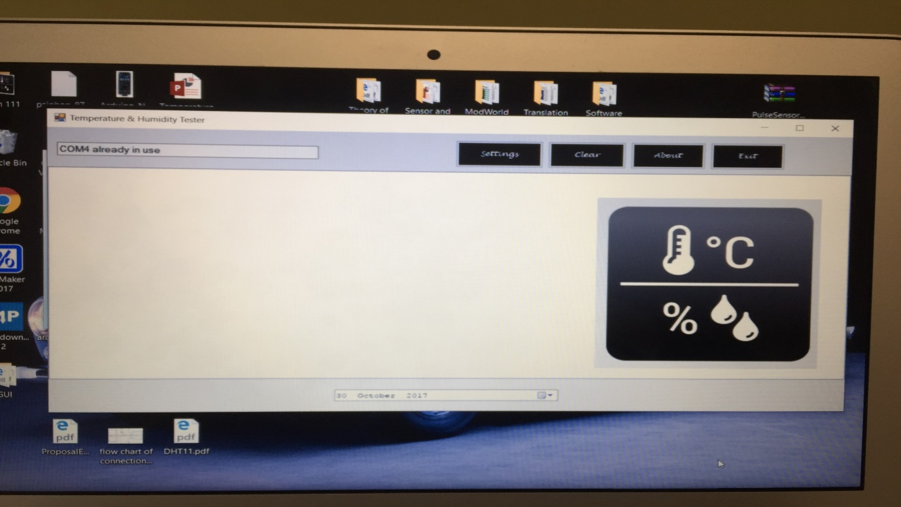

# Sensors and Sensing Technologies & Internet of Things Projects

## Temperature Measuring with Thermistor Sensor

*A thermistor is a type of resistor whose resistance is dependent on temperature, more so than in standard resistors. The word is a portmanteau of thermal and resistor. Thermistors are widely used as inrush current limiters, temperature sensors (negative temperature coefficient or NTC type typically), self-resetting overcurrent protectors, and self-regulating heating elements (positive temperature coefficient or PTC type typically).*

### Here is the code that will work together with the arduino for the Thermistor sensor

```
int ThermistorPin = 0;

int Vo;

float R1 = 10000;

float logR2, R2, T;

float c1 = 1.009249522e-03, c2 = 2.378405444e-04, c3 = 2.019202697e-07;

void setup() {

Serial.begin(9600);

}


void loop() {

  Vo = analogRead(ThermistorPin);

  R2 = R1 * (1023.0 / (float)Vo - 1.0);

  logR2 = log(R2);

  T = (1.0 / (c1 + c2*logR2 + c3*logR2*logR2*logR2));

  T = T - 273.15;


  Serial.print("Temprature"); 

  Serial.print(T);

  Serial.println(" C"); 

  delay(500);

}
```
## Humidity and Temperature Testing Using the DHT11 Sensor

You will need the following;
1. 1 x Arduino Uno
2. 1 x DHT11
3. 1 x 10KΩ Resistor
4. Jumper Wires

### Here is the code to get this working

```
#include "DHT.h"

#define DHTPIN 2     // what digital pin we're connected to

#define DHTTYPE DHT11   // DHT 11

DHT dht(DHTPIN, DHTTYPE);

void setup() {

  Serial.begin(9600);

  Serial.println("DHT11 test!");

  dht.begin();

}

void loop() {

  delay(2000);

  float h = dht.readHumidity();
  float t = dht.readTemperature();
  float f = dht.readTemperature(true);
  
  if (isnan(h) || isnan(t) || isnan(f)) {

    Serial.println("Failed to read from DHT sensor!");

    return;

  }

  float hif = dht.computeHeatIndex(f, h);
  float hic = dht.computeHeatIndex(t, h, false);

  Serial.print("Humidity: ");

  Serial.print(h);

  Serial.println("% ");

  Serial.print("Temperature: ");

  Serial.print(t);

  Serial.print(" *C ");

  Serial.print(f);

  Serial.println(" *F\t");

  Serial.print("Heat index: ");

  Serial.print(hic);

  Serial.print(" *C ");

  Serial.print(hif);

  Serial.println(" *F");

  Serial.println("");

}
```
## The GUI for the Project
*The GUI was made using Visual Studio using C# language*



## Project Circuit Diagram


## Project Connections


## Finally 
The rest of the project information is in the files listed below;
1. Final Project Proposal
2. Project Documentation
3. Final Project Presentation
4. GUI Files Project
